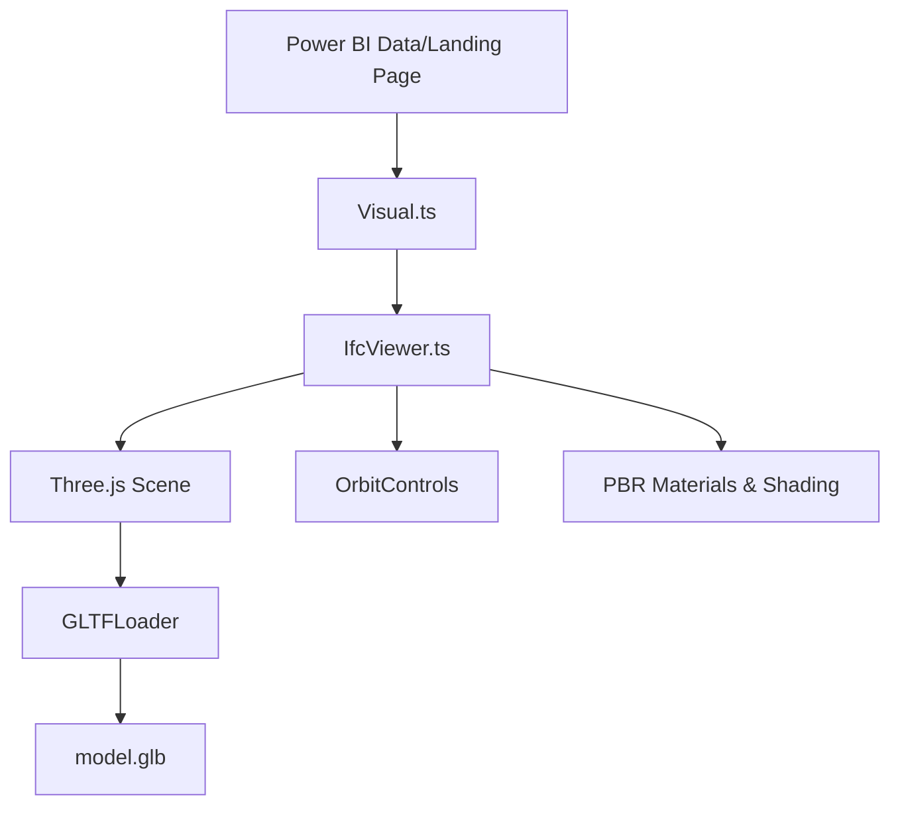

# IFC Lite Viewer (Power BI Visual)

A high-performance, visually refined 3D IFC model viewer for Power BI. Built with **Three.js** and **web-ifc**, this visual allows users to interact with architectural models directly within their Power BI reports.

## Architecture

The following diagram illustrates the data flow and component structure of the visual:



## Features

- **High-Quality Rendering**: Uses Physically Based Rendering (PBR) for realistic materials and smooth shading.
- **Architectural Clarity**: Automatic edge detection for crisp architectural lines.
- **Interactive Controls**: Full Orbit controls (Rotate, Zoom, Pan) for detailed inspection.
- **Optimized for Power BI**: Lightweight integration that handles complex models with ease.

## Setup & Development

### Prerequisites
- [Power BI Visuals Tools](https://learn.microsoft.com/en-us/power-bi/developer/visuals/environment-setup) (`pbiviz`)
- Node.js

### Installation
```bash
npm install
```

### Packaging
To create the `.pbiviz` package for Power BI:
```bash
pbiviz package
```

### Loading Models
This viewer is optimized for `.glb` models. Use the [ifc2glb-web-ifc](https://github.com/textonym/ifc2glb-web-ifc) tool to convert your IFC files into high-quality formats ready for this viewer.

## Credits & Acknowledgements

This visual is built upon several foundational open-source projects:

- **[IFC-Lite](https://github.com/louistrue/ifc-lite)** by **Louis True** — For the core parsing, rendering architecture, and geometry handling that powers the Lite Viewer experience.
- **[Three.js Authors](https://threejs.org/)** — For the 3D scene engine and rendering pipeline.
- **[D3.js Authors](https://d3js.org/)** — For data manipulation and selection utilities.
- **[Microsoft Power BI](https://learn.microsoft.com/en-us/power-bi/developer/visuals/)** — For the visuals API and developer platform.

## License
MIT
