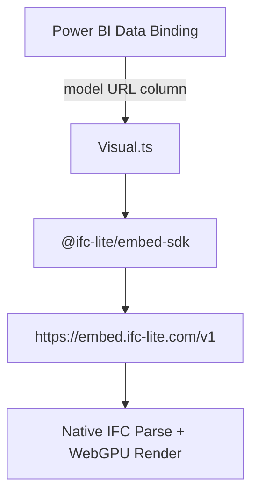

# IFC Lite Viewer (Power BI Visual)

A high-performance 3D IFC model viewer for Power BI. Built with **[@ifc-lite/embed-sdk](https://github.com/louistrue/ifc-lite)**, this visual allows users to interact with architectural models directly within their Power BI reports — no offline IFC-to-GLB conversion required.

## Architecture



## Features

All features are provided out of the box by the embedded ifc-lite viewer:

- **Native IFC parsing** — no GLB conversion step needed, just pass an `.ifc` URL
- **WebGPU rendering** — automatic, high-performance rendering
- **Element properties panel** — built into the viewer UI
- **BCF 2.1 issue management** — built in
- **IDS validation** — built in
- **2D floor plans / sections** — built in
- **Federation (multi-model)** — via `embed.addModel(url)`
- **Programmatic selection** — via `embed.select([id])`
- **Color overrides for heatmaps** — via `embed.setColors({id: [r,g,b,a]})`
- **Screenshots** — via `embed.getScreenshot()`
- **Section planes** — via `embed.setSection({axis:'Z', position:0.5})`
- **Cross-filtering** — entity selection in the viewer triggers Power BI cross-filtering

## Setup & Development

### Prerequisites
- [Power BI Visuals Tools](https://learn.microsoft.com/en-us/power-bi/developer/visuals/environment-setup) (`pbiviz`)
- Node.js

### Installation
```bash
npm install
```

### Packaging
To create the `.pbiviz` package for Power BI:
```bash
pbiviz package
```

### Loading Models

Bind a data column containing the HTTPS URL of your IFC file in Power BI's field well. Model files can be served from:

- **SharePoint document library** — direct HTTPS URL
- **Azure Blob Storage** — with CORS configured for `embed.ifc-lite.com`
- **Any HTTPS endpoint** — that returns `Content-Type: application/octet-stream`

### CORS Configuration

The embed viewer fetches the IFC file from the browser. The server hosting the IFC must return:

```
Access-Control-Allow-Origin: https://embed.ifc-lite.com
Access-Control-Allow-Methods: GET
```

- **Azure Blob Storage**: set CORS rules in Storage Account → Resource Sharing (CORS) blade.
- **SharePoint**: CORS policy already allows cross-origin reads for authenticated users.

## Credits & Acknowledgements

- **[IFC-Lite](https://github.com/louistrue/ifc-lite)** (Licensed under [MPL-2.0](https://github.com/louistrue/ifc-lite/blob/main/LICENSE)) — By **Louis True**. Core IFC viewer embedded via `@ifc-lite/embed-sdk`.
- **[D3.js](https://github.com/d3/d3)** — For data manipulation and selection utilities.
- **[Microsoft Power BI Tools](https://github.com/microsoft/PowerBI-visuals-tools)** — For the visuals development platform.

## License

The Power BI visual wrapper code is MIT licensed.
This visual embeds the ifc-lite viewer via `@ifc-lite/embed-sdk`, which is Mozilla Public License 2.0.
Source: https://github.com/louistrue/ifc-lite
